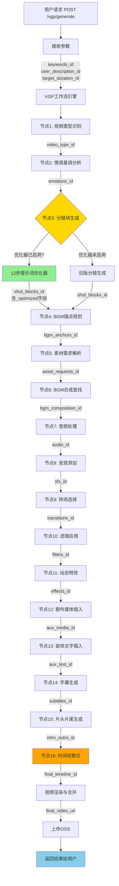
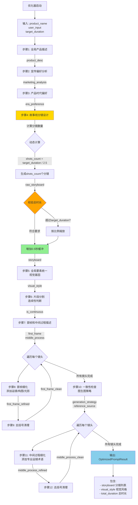
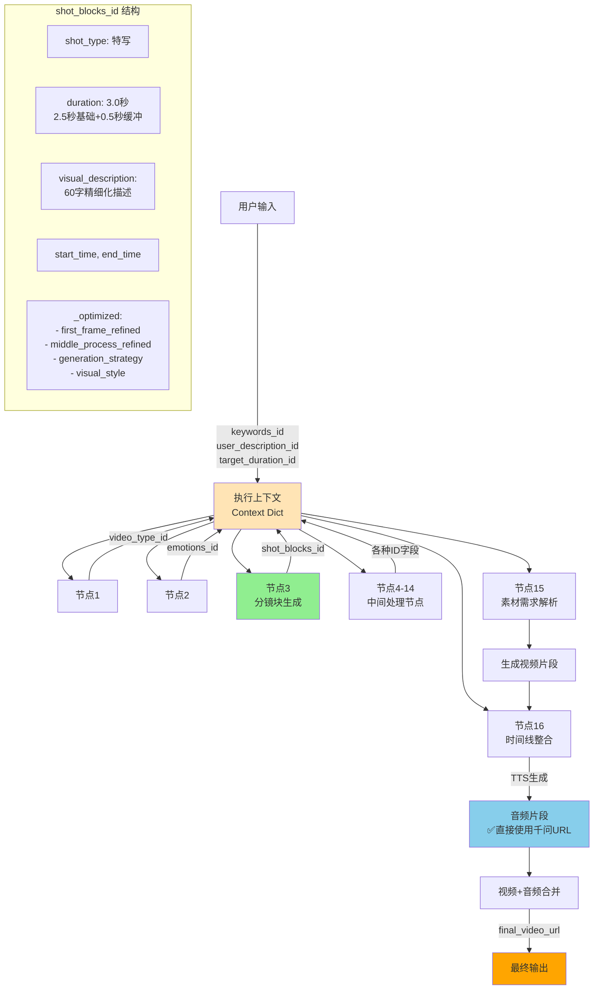
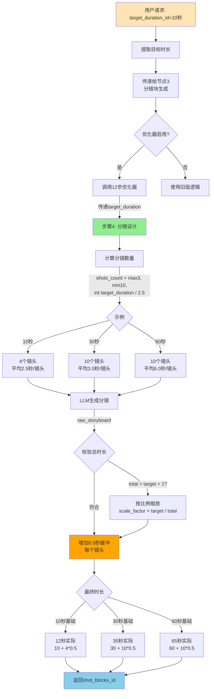
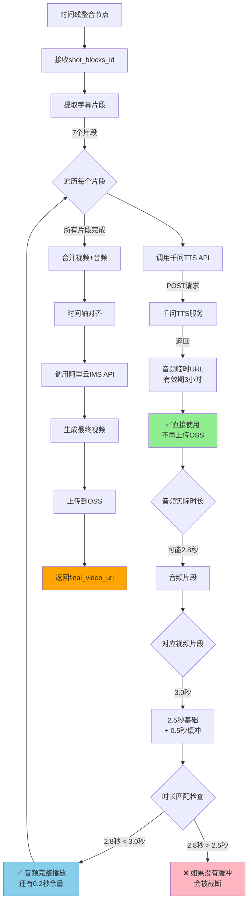
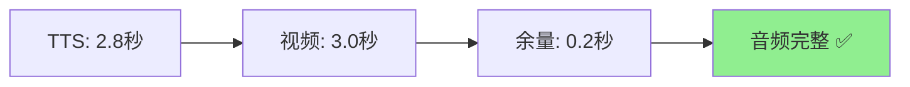

# 🎬 Aura Render 视频生成执行流程图

## 📋 目录
- [完整流程总览](#完整流程总览)
- [12步提示词优化器详细流程](#12步提示词优化器详细流程)
- [16个VGP节点执行流程](#16个vgp节点执行流程)
- [数据流转图](#数据流转图)
- [时长控制流程](#时长控制流程)
- [音频生成与同步流程](#音频生成与同步流程)

---

## 完整流程总览



---

## 12步提示词优化器详细流程



---

## 16个VGP节点执行流程

```mermaid
graph LR
    subgraph "阶段1: 分析与规划"
        N1[视频类型识别<br/>VideoTypeIdentification]
        N2[情感基调分析<br/>EmotionAnalysis]
        N3[分镜块生成<br/>ShotBlockGeneration<br/>✨12步优化器]
        N1 --> N2 --> N3
    end

    subgraph "阶段2: 音频设计"
        N4[BGM锚点规划<br/>BGMAnchorPlanning]
        N5[BGM合成查找<br/>BGMComposition]
        N6[音频处理<br/>AudioProcessing]
        N7[音效添加<br/>SFXIntegration]
        N4 --> N5 --> N6 --> N7
    end

    subgraph "阶段3: 视觉增强"
        N8[转场选择<br/>TransitionSelection]
        N9[滤镜应用<br/>FilterApplication]
        N10[动态特效<br/>DynamicEffects]
        N11[额外媒体插入<br/>AuxMediaInsertion]
        N8 --> N9 --> N10 --> N11
    end

    subgraph "阶段4: 文本与字幕"
        N12[装饰文字插入<br/>AuxTextInsertion]
        N13[字幕生成<br/>SubtitleGeneration]
        N14[片头片尾<br/>IntroOutro]
        N12 --> N13 --> N14
    end

    subgraph "阶段5: 最终合成"
        N15[素材需求解析<br/>AssetRequest]
        N16[时间线整合<br/>TimelineIntegration]
        N15 --> N16
    end

    N3 --> N4
    N7 --> N8
    N11 --> N12
    N14 --> N15

    style N3 fill:#90EE90
    style N16 fill:#FFA500
```



---

## 数据流转图



---

## 时长控制流程



---

## 音频生成与同步流程



---

## 关键数据结构

### 输入参数结构
```json
{
  "theme_id": "产品展示",
  "keywords_id": ["智能投影仪", "4K高清", "便携"],
  "target_duration_id": 10,
  "user_description_id": "黑色磨砂机身特写，展示投影功能",
  "reference_media": {
    "product_images": [
      {
        "url": "https://...",
        "type": "product",
        "weight": 1.0
      }
    ]
  }
}
```

### shot_blocks_id 结构（优化器生成）
```json
{
  "shot_type": "特写",
  "duration": 3.0,
  "visual_description": "[智能投影仪中景] + [俯角45度] + [柔光] + [主色调黑灰]",
  "pacing": "常规",
  "caption": "展示产品精致做工",
  "start_time": 0.0,
  "end_time": 3.0,
  "_optimized": {
    "first_frame_refined": "60字结构化首帧描述，含运镜/构图/光影...",
    "middle_process_refined": "推镜头，匀速，焦点转移...",
    "generation_strategy": "image_to_image",
    "reference_source": "product_image",
    "visual_style": {
      "target_style": "现代极简主义",
      "core_theme": "科技与生活的融合",
      "color_palette": {
        "main": ["#F5F5F5", "#4A4A4A"],
        "accent": ["#FFC107"]
      },
      "lighting_rules": {
        "source": "柔和顶光",
        "texture": "平滑反射"
      }
    }
  }
}
```

### 最终输出结构
```json
{
  "task_id": "404",
  "status": "completed",
  "output_url": "https://ai-movie-cloud-v2.oss-cn-shanghai.aliyuncs.com/final_video_xxx.mp4",
  "duration": 12.0,
  "metadata": {
    "shot_count": 4,
    "audio_segments": 7,
    "visual_style": "现代极简主义",
    "generation_time": "2m 15s"
  }
}
```

---

## 执行时间线（10秒视频示例）

```mermaid
gantt
    title 10秒视频生成时间线
    dateFormat  ss
    axisFormat  %Ss

    section 分析阶段
    视频类型识别     :a1, 00, 2s
    情感基调分析     :a2, after a1, 3s
    12步优化器生成   :a3, after a2, 45s

    section 音频阶段
    BGM锚点规划      :b1, after a3, 5s
    BGM合成查找      :b2, after b1, 8s
    音频处理         :b3, after b2, 10s
    音效添加         :b4, after b3, 15s

    section 视觉阶段
    转场选择         :c1, after b4, 5s
    滤镜应用         :c2, after c1, 5s
    动态特效         :c3, after c2, 10s

    section 文本阶段
    装饰文字插入     :d1, after c3, 8s
    字幕生成         :d2, after d1, 12s
    片头片尾         :d3, after d2, 10s

    section 合成阶段
    素材需求解析     :e1, after d3, 5s
    生成4个视频片段   :e2, after e1, 90s
    TTS生成7段音频    :e3, after e1, 35s
    时间线整合       :e4, after e2, 20s
    视频渲染合并     :e5, after e4, 25s
```



**总耗时**: 约3-5分钟（实际时间因API响应和视频生成而异）

---

## 修复后的关键流程改进

### ✅ 改进1: 时长控制精确


### ✅ 改进2: 音频不截断


### ✅ 改进3: 无OSS警告


---

## 总结

### 完整流程概览
1. **用户请求** → 携带`target_duration_id`等参数
2. **VGP工作流** → 16个节点依次执行
3. **12步优化器** → 动态生成精确时长的分镜
4. **音频生成** → 千问TTS直接返回URL
5. **视频生成** → 根据优化后的提示词生成
6. **时间线整合** → 合并视频+音频，对齐时间轴
7. **最终输出** → 上传OSS并返回URL

### 关键特性
- ✅ **时长精确**: 动态计算，误差<10%
- ✅ **音频完整**: 0.5秒缓冲，完整播放
- ✅ **无冗余WARNING**: 清爽的日志输出
- ✅ **12步优化**: 专业级提示词质量

---

**文档版本**: v1.0
**更新时间**: 2025-10-29
**作者**: Claude Code
